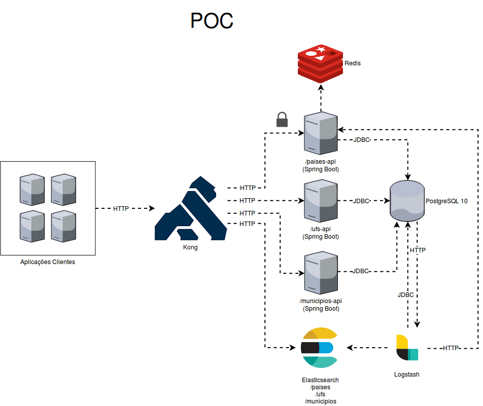

# reporting database example

## POC



### Dependências

- JDK 1.8
- docker
- docker-compose

### Como construir?

Para construir as imagens, rode o comando:

```bash
./build.sh
```
 
Esse script irá criar as imagens docker de todos os componentes da solução:

- paises-api
- ufs-api
- municipios-api
- postgresql
- redis 
- elasticsearch
- logstash
- kong
- kong-database
- kong-migrations

Para verificar se a construção teve sucesso, rode o comando:

```bash
docker images
```

Você deve ver algo como:

```bash
REPOSITORY                                          TAG                 IMAGE ID            CREATED             SIZE
com.paavieira/kong-migrations           latest              7d2c04ec773f        About an hour ago   92.3MB
com.paavieira/kong-database             latest              677715edfa81        About an hour ago   237MB
com.paavieira/kong                      latest              eab64aabb14e        3 hours ago         92.3MB
com.paavieira/redis                     latest              95c86fe30b5f        3 hours ago         83.4MB
com.paavieira/logstash                  latest              08696227b1ea        3 hours ago         660MB
com.paavieira/elasticsearch             latest              35f39bb4da6a        3 hours ago         673MB
com.paavieira/municipios-api            latest              c76fc373a685        3 hours ago         133MB
com.paavieira/ufs-api                   latest              3bae71b2e61a        3 hours ago         133MB
com.paavieira/paises-api                latest              d88d9dd6fded        3 hours ago         139MB
com.paavieira/postgresql                latest              f509982906e7        3 hours ago         246MB
```

### Como executar?

Para executar as imagens, rode o comando:

```bash
docker-compose up -d
```

### Como testar?

Para verificar se está tudo ok, execute o comando:

```bash
docker-compose ps
```

O resultado esperado é algo como:

```
        Name                       Command               State                                     Ports                                  
------------------------------------------------------------------------------------------------------------------------------------------
reporting-database-example_elasticsearch_1     /usr/local/bin/docker-entr ...   Up       9200/tcp, 9300/tcp                                                      
reporting-database-example_kong-database_1     docker-entrypoint.sh postgres    Up       5432/tcp                                                                
reporting-database-example_kong-migrations_1   /docker-entrypoint.sh /bin ...   Exit 0                                                                           
reporting-database-example_kong_1              /docker-entrypoint.sh kong ...   Up       0.0.0.0:8000->8000/tcp, 0.0.0.0:8001->8001/tcp, 0.0.0.0:8443->8443/tcp, 
                                                                  0.0.0.0:8444->8444/tcp                                                  
reporting-database-example_logstash_1          /usr/local/bin/docker-entr ...   Up       5044/tcp, 8080/tcp, 9600/tcp                                            
reporting-database-example_municipios-api_1    java -Djava.security.egd=f ...   Up       8080/tcp                                                                
reporting-database-example_paises-api_1        java -Djava.security.egd=f ...   Up       8080/tcp                                                                
reporting-database-example_postgresql_1        docker-entrypoint.sh postgres    Up       5432/tcp                                                                
reporting-database-example_redis_1             docker-entrypoint.sh redis ...   Up       6379/tcp                                                                
reporting-database-example_ufs-api_1           java -Djava.security.egd=f ...   Up       8080/tcp                                                                
```

Opcionalmente, execute o comando abaixo para saber se o [Kong] está no ar:

```bash
curl -i http://localhost:8001/
```

O resultado esperado é o código HTTP **200 (OK)** e algumas informações a respeito do Kong.

Para saber mais sobre as gestão dos serviços no Kong, leia as orientações no arquivo [kong.md](/poc/docs/kong.md).

### FAQ

#### Estou recebendo o erro "max virtual memory areas vm.max_map_count [65530] is too low, increase to at least [262144]" ao subir o ElasticSearch

**TLDR;** execute o comando abaixo:

```bash
sudo sysctl -w vm.max_map_count=262144
```

Para saber mais detalhes, visite a documentação:

https://www.elastic.co/guide/en/elasticsearch/reference/current/docker.html#docker-cli-run-prod-mode


#### Modifiquei a imagem de um módulo. Como faço para subir as alterações?

Passo 1: pare e remova os containers

```bash
docker-compose stop
docker-compose rm
```

Passo 2: construa novamente as imagens

```bash
./build.sh
```

Passo 3: suba novamente os containers com as imagens atualizadas

```bash
docker-compose up
```